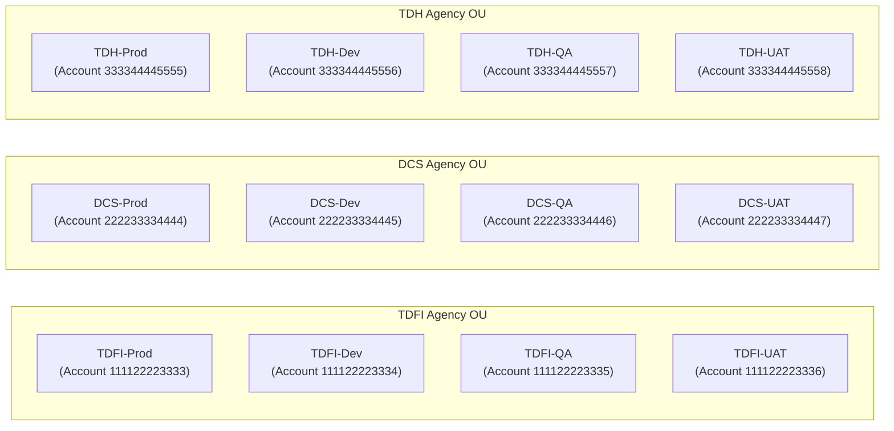
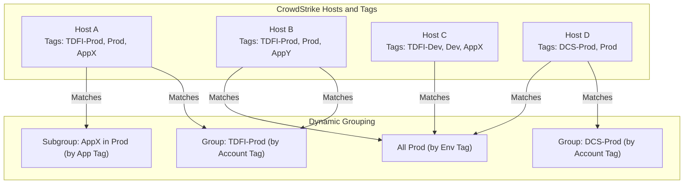
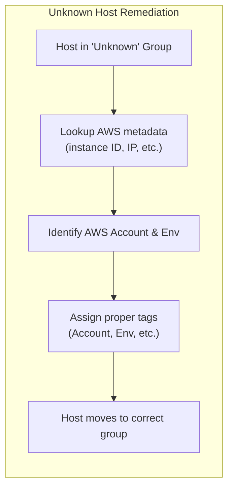

# AWS Organizational Grouping Strategy

## Overview 
This document proposes a structured AWS account hierarchy tailored to our agency’s operations and security needs. The strategy uses a **hybrid grouping model** that organizes AWS accounts first by **agency** and second by **environment**. By aligning the hierarchy with agencies (e.g., **TDFI**, **DCS**, **TDH**) and segmenting by environments (Prod, Dev, QA, UAT), we achieve clear ownership boundaries and functional isolation. This structure enhances security, simplifies management, and maps naturally to cost and responsibility centers ([Organizing Your AWS Environment Using Multiple Accounts - Organizing Your AWS Environment Using Multiple Accounts](https://docs.aws.amazon.com/whitepapers/latest/organizing-your-aws-environment/organizing-your-aws-environment.html#:~:text=Customers%20might%20have%20multiple%20teams,need%20clarity%20around%20costs%20incurred)) ([Organizing Your AWS Environment Using Multiple Accounts - Organizing Your AWS Environment Using Multiple Accounts](https://docs.aws.amazon.com/whitepapers/latest/organizing-your-aws-environment/organizing-your-aws-environment.html#:~:text=Customers%20need%20explicit%20security%20boundaries%2C,help%20you%20meet%20these%20needs)). It also aligns with CrowdStrike’s sensor grouping approach, ensuring our cloud and security frameworks reinforce each other.

## Primary Grouping by Agency 
**Agency-based account grouping** is the top level of the hierarchy. Each agency (TDFI, DCS, TDH, etc.) is allocated its own Organizational Unit (OU) containing that agency’s AWS accounts. This ensures **clear ownership and isolation** of resources per agency:
- **Ownership and accountability:** Each agency OU has full control over its accounts, making it easy to assign responsibility and track costs per agency ([Organizing Your AWS Environment Using Multiple Accounts - Organizing Your AWS Environment Using Multiple Accounts](https://docs.aws.amazon.com/whitepapers/latest/organizing-your-aws-environment/organizing-your-aws-environment.html#:~:text=Customers%20might%20have%20multiple%20teams,need%20clarity%20around%20costs%20incurred)).
- **Security isolation:** Resources and data for one agency are separated from others by default. AWS accounts act as natural security boundaries—no access is allowed between accounts unless explicitly granted ([Organizing Your AWS Environment Using Multiple Accounts - Organizing Your AWS Environment Using Multiple Accounts](https://docs.aws.amazon.com/whitepapers/latest/organizing-your-aws-environment/organizing-your-aws-environment.html#:~:text=By%20default%2C%20no%20access%20is,between%20those%20environments%20by%20default)). This means one agency’s data or workloads cannot inadvertently impact another’s.
- **Compliance and policy control:** Different agencies may have unique compliance requirements. Having separate OUs lets us apply specific Service Control Policies (SCPs) or guardrails per agency as needed, without affecting others.

In practice, an AWS Organization would have an OU for each agency. For example, a **TDFI OU** contains all AWS accounts related to the TDFI agency. This primary grouping by agency reflects our organizational structure in the cloud and ensures each agency’s cloud resources are managed in isolation but under centralized governance.

## Secondary Grouping by Environment 
Within each agency’s OU, accounts are further grouped by **environment** (Production, Development, QA, UAT, etc.). This **environmental segmentation** is a secondary layer of organization:
- **Isolation of environments:** By separating production and non-production into distinct accounts, we protect critical systems. AWS best practices recommend isolating production workloads from development/test workloads in separate accounts ([Best practices for a multi-account environment - AWS Organizations](https://docs.aws.amazon.com/organizations/latest/userguide/orgs_best-practices.html#:~:text=An%20AWS%20account%20provides%20natural,test%2Fdevelopment%20workloads%20in%20separate%20accounts)). For instance, if TDFI has a production account and a dev account, no network access or resource sharing exists between them by default, reducing risk of cross-contamination ([Organizing Your AWS Environment Using Multiple Accounts - Organizing Your AWS Environment Using Multiple Accounts](https://docs.aws.amazon.com/whitepapers/latest/organizing-your-aws-environment/organizing-your-aws-environment.html#:~:text=By%20default%2C%20no%20access%20is,between%20those%20environments%20by%20default)).
- **Clarity and context:** Each account’s purpose is clear from its designation. Teams instantly know an account’s role (e.g., “DCS-Dev” vs “DCS-Prod”), minimizing confusion. This clarity helps both in cloud management and in security monitoring (like tagging in CrowdStrike).
- **Environment-specific policies:** We can apply different guardrails or AWS Config rules to prod vs. non-prod. For example, stricter controls (like no admin access without MFA) on **Prod** accounts, while allowing more flexibility in **Dev/QA** accounts. The OU structure can reflect this: under each agency OU, a **Prod OU** could hold the prod account and a **NonProd OU** (or multiple OUs for Dev/QA/UAT) hold lower environment accounts. This enforces consistent environment management across agencies.

Each agency thus contains accounts segmented by environment. For example, within the **DCS OU**, there might be a **DCS-Prod** account, a **DCS-Dev** account, etc. This two-tier (agency -> environment) approach provides both organizational alignment and functional separation.

## Hybrid Agency-Environment Model Justification 
The proposed **Agency-Environment** hierarchy is a hybrid model combining organizational and functional isolation:
- **Organizational isolation:** Grouping by agency first means each agency’s AWS footprint is self-contained. This aligns with our operational structure and simplifies cross-team boundaries. In multi-team organizations, using separate accounts/OUs for different groups is recommended to meet differing security or compliance needs ([Organizing Your AWS Environment Using Multiple Accounts - Organizing Your AWS Environment Using Multiple Accounts](https://docs.aws.amazon.com/whitepapers/latest/organizing-your-aws-environment/organizing-your-aws-environment.html#:~:text=Customers%20might%20have%20multiple%20teams,need%20clarity%20around%20costs%20incurred)). Here, each agency can operate almost like a tenant in the AWS Organization, with minimal interference.
- **Functional isolation:** Environment-based grouping ensures that production environments are walled off from development/testing. This follows AWS best practices for multi-account setups, where production environments are isolated under dedicated OUs ([Best practices for a multi-account environment - AWS Organizations](https://docs.aws.amazon.com/organizations/latest/userguide/orgs_best-practices.html#:~:text=Group%20workloads%20based%20on%20business,purpose%20and%20not%20reporting%20structure)). By combining this with agency separation, we maintain **both** kinds of isolation. 
- **Balance of clarity and security:** A pure agency-only model might mix prod and dev together, risking security issues. A pure environment-only model (all prod accounts together) would split agencies and complicate ownership. This hybrid model strikes a balance: **clear ownership by agency, and clear separation by environment**. It prevents, for example, a developer in one agency’s dev account from accidentally accessing another agency’s prod resources – both agency boundary and environment boundary stop it.
- **Scalability:** The model is flexible. New agencies can be added as new top-level groups without affecting others. New environments (if ever needed) can be added per agency. We remain within AWS Organizations limits (OUs can be nested up to 5 levels deep, which we won’t exceed). The design can scale to dozens of agencies or environment variants if necessary while keeping structure logical.
- **Cost and management alignment:** AWS accounts provide a billing boundary. By having an account per agency per environment, we can track costs at a granular level (e.g., DCS Dev costs vs DCS Prod costs) easily. This mapping to agencies and environments makes budget allocation, chargeback, or optimization efforts more straightforward ([Organizing Your AWS Environment Using Multiple Accounts - Organizing Your AWS Environment Using Multiple Accounts](https://docs.aws.amazon.com/whitepapers/latest/organizing-your-aws-environment/organizing-your-aws-environment.html#:~:text=Customers%20might%20have%20multiple%20teams,need%20clarity%20around%20costs%20incurred)) ([Organizing Your AWS Environment Using Multiple Accounts - Organizing Your AWS Environment Using Multiple Accounts](https://docs.aws.amazon.com/whitepapers/latest/organizing-your-aws-environment/organizing-your-aws-environment.html#:~:text=Customers%20need%20explicit%20security%20boundaries%2C,help%20you%20meet%20these%20needs)).

In summary, the Agency-Environment model leverages the strengths of multi-account strategy (security, reliability, cost visibility ([Organizing Your AWS Environment Using Multiple Accounts - Organizing Your AWS Environment Using Multiple Accounts](https://docs.aws.amazon.com/whitepapers/latest/organizing-your-aws-environment/organizing-your-aws-environment.html#:~:text=Customers%20need%20explicit%20security%20boundaries%2C,help%20you%20meet%20these%20needs))) in a way that mirrors our organizational needs. It maintains **organizational clarity** (each agency knows where their stuff lives) and **functional safety** (dev/test completely separated from prod by account isolation).

## AWS Account Hierarchy Mapping 
Below is the **mapping of AWS accounts** (from the provided list) into this structured hierarchy. Each agency has multiple accounts, one per environment:

- **TDFI (Agency)** – *OU: TDFI*  
  - **TDFI-Prod** – AWS Account `111122223333` (Production environment for TDFI)  
  - **TDFI-Dev** – AWS Account `111122223334` (Development environment for TDFI)  
  - **TDFI-QA** – AWS Account `111122223335` (QA/Test environment for TDFI)  
  - **TDFI-UAT** – AWS Account `111122223336` (UAT/Staging environment for TDFI)  

- **DCS (Agency)** – *OU: DCS*  
  - **DCS-Prod** – AWS Account `222233334444` (Production environment for DCS)  
  - **DCS-Dev** – AWS Account `222233334445` (Development environment for DCS)  
  - **DCS-QA** – AWS Account `222233334446` (QA/Test environment for DCS)  
  - **DCS-UAT** – AWS Account `222233334447` (UAT/Staging environment for DCS)  

- **TDH (Agency)** – *OU: TDH*  
  - **TDH-Prod** – AWS Account `333344445555` (Production environment for TDH)  
  - **TDH-Dev** – AWS Account `333344445556` (Development environment for TDH)  
  - **TDH-QA** – AWS Account `333344445557` (QA/Test environment for TDH)  
  - **TDH-UAT** – AWS Account `333344445558` (UAT/Staging environment for TDH)  

*(Note: Account IDs above are examples. The actual provided account list should map accordingly. Each account is placed under its respective Agency OU and labeled by environment.)*

This mapping ensures every AWS account is accounted for in the hierarchy and is uniquely identified by agency and environment. For instance, the account ending in **3336** is clearly “TDFI’s UAT account,” under the TDFI grouping and for UAT purposes. Such mapping makes it easier for administrators and security teams to know what each account is for and who owns it, at a glance.

To visualize the structure, below is a diagram of the AWS account hierarchy:

*Diagram 1: AWS Organizational Hierarchy by Agency and Environment.* Each agency is a top-level grouping (OU) containing separate accounts for each environment (Prod, Dev, QA, UAT). This structure enforces both agency-level isolation and environment isolation within each agency.

## Alignment with CrowdStrike Tagging Strategy 
The AWS account hierarchy is designed to integrate seamlessly with our **CrowdStrike Falcon sensor grouping and tagging strategy** (detailed in Document 2). Because we group AWS accounts by agency and environment, we can leverage those same identifiers in CrowdStrike:
- **Consistent Tagging:** We will tag CrowdStrike sensors with their AWS **Account ID** (or an alias like agency-environment) to automatically associate a host with the correct agency and environment. For example, a host in account `222233334444` (DCS-Prod) might get a tag “DCS-Prod” or tags `DCS` and `Prod`. This mirrors the AWS hierarchy.
- **Sensor Grouping:** In CrowdStrike, dynamic host groups can be defined by AWS account number and other tags ([Crowdstrike : Host Groups – TECHNOLOGY   TUTORIALS](https://jadirnetwork.wordpress.com/2020/10/21/crowdstrike-host-groups-all-details/#:~:text=removed%20,Manufacturer)) ([Crowdstrike : Host Groups – TECHNOLOGY   TUTORIALS](https://jadirnetwork.wordpress.com/2020/10/21/crowdstrike-host-groups-all-details/#:~:text=,Type%20%28Windows%20Only)). Our hierarchy ensures that if a sensor reports from a given account, we know exactly which group (agency/environment) it belongs to. The account separation thus drives the first level of sensor grouping.
- **Isolation for security:** Just as accounts are isolated, CrowdStrike groups and policies can be isolated. For instance, sensors in “TDH-Dev” group might have a different policy (perhaps a less strict one for test systems) than sensors in “TDH-Prod” group, reflecting the risk difference. The account-environment structure provides an easy key for applying such differential policies.
- **Automation:** The mapping above will be used in automation scripts (in CI/CD) to apply the correct tags to each deployed server’s CrowdStrike agent. This means whenever a new EC2 instance or server comes up in a particular account, it can programmatically receive the appropriate agency and environment tag, placing it in the right CrowdStrike group without manual intervention.

By aligning the AWS account hierarchy with CrowdStrike’s tagging, we create a unified **cloud-to-endpoint security mapping**. Cloud resource ownership and security posture can be correlated directly: if an alert comes from a CrowdStrike sensor tagged “DCS-Prod”, everyone immediately knows it’s a production issue in the DCS agency’s AWS environment. This direct line-of-sight improves incident response and overall clarity for DevOps and security teams.

---

# CrowdStrike Tagging and Sensor Grouping Strategy

## Overview 
This document outlines a strategy for **tagging CrowdStrike Falcon sensors** and grouping hosts that ties directly into our AWS organizational structure. The goal is to ensure that each endpoint (server or instance) in AWS is automatically classified in CrowdStrike by its AWS account and environment, with flexibility to add more granular tags (like application or role). This approach creates a **hierarchical grouping**: AWS account (agency) is the primary grouping key, refined by environment and optionally by application. We will leverage automation (CI/CD pipelines) to apply and update tags, and we will actively manage the “Unknown” group to minimize untagged hosts. The result is a dynamic, clear, and maintainable host grouping model that benefits security operations, DevOps, and leadership visibility.

## Integration with AWS Organizational Structure
Our tagging strategy is built on the foundation of the AWS account hierarchy defined earlier. Each AWS account (grouped by agency and environment) will directly inform how sensors are grouped in CrowdStrike:
- **Account-driven grouping:** We use the AWS **account ID** or a corresponding label as a primary tag for each sensor. Because AWS accounts are already segmented by agency and environment, this inherently groups hosts by agency and environment in CrowdStrike. For example, all hosts running in the **TDFI-Dev AWS account** will share a common tag like “TDFI-Dev” in CrowdStrike. Dynamic host groups can then be created to include all hosts with that tag or even directly by Cloud Account ID if available ([Crowdstrike : Host Groups – TECHNOLOGY   TUTORIALS](https://jadirnetwork.wordpress.com/2020/10/21/crowdstrike-host-groups-all-details/#:~:text=removed%20,Manufacturer)).
- **One-to-one mapping:** We establish a naming convention where CrowdStrike group names mirror AWS accounts. An AWS account named *DCS-Prod* would correspond to a CrowdStrike host group “DCS-Prod”. This one-to-one mapping ensures anyone reviewing CrowdStrike data can immediately recognize the organizational context (which agency and environment a host belongs to).
- **Policy alignment:** Since accounts indicate environment criticality, we can align CrowdStrike policies accordingly. Production account groups (e.g., *TDH-Prod*) might be assigned more restrictive security policies in Falcon (like stricter prevention settings), whereas dev/test account groups (e.g., *TDH-Dev* or *TDH-QA*) might have policies that allow more latitude for testing. The account-centric grouping makes this straightforward to manage.

By using AWS accounts as the anchor for grouping, we ensure our cloud security posture (AWS side) is reflected in our endpoint security tool (CrowdStrike). This tight integration reduces complexity – AWS accounts drive the structure, and CrowdStrike follows that lead.

## Hierarchical Tagging and Grouping Strategy 
While AWS account tags form the base grouping, we enhance flexibility by adding **hierarchical tags** on each sensor:
1. **AWS Account Tag (Agency)** – *Primary.* This is typically the 12-digit AWS account number or a clear alias (like “TDFI-Prod”). It identifies which AWS account the host belongs to. Example: `222233334444` or `DCS-Prod`. CrowdStrike can use Cloud Account ID directly in dynamic group rules ([Crowdstrike : Host Groups – TECHNOLOGY   TUTORIALS](https://jadirnetwork.wordpress.com/2020/10/21/crowdstrike-host-groups-all-details/#:~:text=removed%20,Manufacturer)), but we also apply it as a custom tag for consistency across all hosts.
2. **Environment Tag** – *Secondary.* If not already obvious from the account alias, an environment tag like `Prod`, `Dev`, `QA`, or `UAT` is added. In cases where the account name already includes environment (as in our naming convention), this may seem redundant, but having an explicit environment tag allows additional filtering. For instance, one could find “all Dev environment hosts across agencies” by filtering by the `Dev` tag.
3. **Application/Role Tag** – *Tertiary (optional).* We allow adding an application name, project code, or server role as a tag. This is not derived from the AWS org structure but from the host’s purpose. For example, within **DCS-Dev**, some hosts might be tagged `AppX` vs `AppY` to distinguish application X’s dev servers from application Y’s. This level is optional and can be used when teams want to differentiate hosts within the same account/environment for more granular policy application or searches.

A host’s CrowdStrike **Sensor Grouping Tags** field can carry multiple tags (comma-separated) ([crowdstrike.falcon.falconctl module – Configure CrowdStrike Falcon Sensor — Ansible collections  documentation](https://crowdstrike.github.io/ansible_collection_falcon/falconctl_module.html#:~:text=string)), which we will use to our advantage. For example, an EC2 instance running an application *Foobar* in the TDFI agency’s QA environment could have tags: `TDFI-QA, QA, Foobar`. The **primary grouping** (“TDFI-QA”) might suffice for most grouping needs, but the additional `Foobar` tag lets us create a specific group or query for that application if needed.

**Hierarchical grouping logic:** We prioritize grouping by account first, then refine:
- CrowdStrike Host Group rules will first segment by account tag. Under that grouping, filters by environment or application tags can further narrow down hosts if necessary for specific use cases (though technically CrowdStrike groups are flat, we conceptually layer them via naming convention and tags).
- This means our **dynamic groups** in CrowdStrike might be defined like:
  - Group “TDFI-Prod”: rule = *Cloud Service Account ID = 111122223333* (or Tag contains “TDFI-Prod”).
  - Group “TDFI-Prod – AppA”: rule = *Tag contains “111122223333” AND Tag contains “AppA”* (thus only AppA in TDFI Prod).
  - Group “All Prod” (if we want an overarching view): rule = *Tag contains “Prod”*. (This would span multiple accounts, useful for broad oversight.)

This hierarchical tagging ensures **flexibility**. Security teams can drill down from agency->environment->application in their views. Leadership can get reports per agency or environment easily by filtering on those tags.

Below is a diagram illustrating the tagging hierarchy and how hosts would be grouped:

*Diagram 2: CrowdStrike Tagging Hierarchy.* Hosts carry multiple tags (Account/Agency, Environment, and optionally Application). Dynamic groups use these tags to organize hosts. For example, Host A and B are both in the **TDFI-Prod** account, so they fall under the “TDFI-Prod” group. Host A (AppX) also falls under an AppX-specific subgroup for Prod. All Prod-tagged hosts (A, B, D) fall under an “All Prod” umbrella group as well. This shows the flexible slicing possible with our tagging scheme.

## Automated Tagging via CI/CD Pipelines 
To implement the above tagging consistently, we will automate the assignment of sensor tags as part of our deployment and configuration processes:
- **Provisioning Scripts:** Whenever a new server or instance is created (through Infrastructure-as-Code templates, auto-scaling groups, or manual provisioning), a startup script will run to set the CrowdStrike sensor grouping tags for that host. For example, using the Falcon sensor command-line (`falconctl` on Linux or registry settings on Windows) to set tags like `--tags "DCS-Dev,Dev,AppX"` during bootstrapping. This can be baked into AMI user-data or container startup commands.
- **CI/CD Integration:** Our CI/CD pipelines (Jenkins, GitLab CI, etc.) that deploy to AWS will include steps to determine the target AWS account and environment, and pass the appropriate tags to the instance. This could be done by injecting environment variables or using configuration management. Essentially, the pipeline knows “I am deploying to *Account 222233334445 (DCS-Dev)*, so I’ll ensure the sensor on these instances gets the tags `DCS-Dev,Dev` (plus any app tag if deploying a specific application).”
- **Dynamic Updates:** In cases of changes, such as moving a host to a different environment or repurposing it, automation should update its tags. We can script the CrowdStrike API to update sensor tags if needed, but generally hosts don’t move between accounts/environments frequently. The CI/CD pipeline’s role is mainly at creation time. For long-running instances, if their role changes, we’ll rely on configuration management (Ansible, Puppet, etc., which can run a command to update the tag on the sensor).
- **Minimized manual effort:** By automating tagging, we **reduce the operational load** on administrators. There’s no need to manually log into the CrowdStrike console to tag or group hosts. Instead, tags are applied deterministically by code. As new AWS accounts are added or environments spun up, we simply update the automation (e.g., add a new account ID -> tag mapping in a config file or pipeline library), and all new deployments there will carry the correct tags.

Using CI/CD for tagging ensures **consistency and speed**. Every host will immediately join the correct CrowdStrike group upon installation of the sensor, thanks to automation. This approach also means our CrowdStrike grouping is always up-to-date with the latest AWS environment changes – if tomorrow we introduce a new agency or environment, as long as we update the pipeline, any new hosts will be properly tagged from day one.

## Handling and Refining the "Unknown" Group 
In CrowdStrike Falcon, the “Unknown” host group typically catches any sensors that do not match defined group criteria (often because they have no grouping tags or unmatched tags). Our goal is to **minimize** membership in the Unknown group and promptly classify any stragglers:
- **Preventative tagging:** The CI/CD automation described above is our first line of defense. By tagging everything upon deployment, no host should end up untagged. However, there might be edge cases (e.g., a legacy instance that had the sensor installed before this process, or a developer machine that wasn’t tagged).
- **AWS metadata integration:** For any host that does appear in “Unknown,” we will use AWS metadata to figure out where it belongs. CrowdStrike provides the capability to view certain system info for a host. If the host is an EC2 instance, we can usually identify it by things like instance ID, private IP, or hostname. Using AWS CLI or AWS inventory, the security team can find which account that instance ID or IP belongs to, and thus determine its agency/environment.
- **Automated script for Unknowns:** We will create a scheduled job (e.g., a Python script using CrowdStrike’s API and AWS SDK) to run periodically. This script will:
  1. Pull the list of hosts in the CrowdStrike “Unknown” group.
  2. For each host, gather identifiable information (hostname, IP, etc.) and query AWS (across our accounts) to find a match. AWS CloudTrail or Systems Manager can help map a CrowdStrike hostname to an instance and thus to an account.
  3. Once the account (and environment) is identified, the script can assign the correct sensor tags via CrowdStrike API or trigger a redeployment of the agent with proper tags.
  4. Move that host out of Unknown into the proper group (this happens automatically once tags are updated or a dynamic group catches the account ID).
- **Refinement of Unknown policy:** In the interim, we will treat Unknown group with a cautious policy (possibly very restrictive, since it’s essentially an unclassified host). But the aim is to have near-zero hosts in Unknown at any given time.

By **actively managing Unknowns**, we prevent orphaned or misclassified sensors from lingering. Every asset should be accounted for in our scheme. This process also acts as a safety net for the tagging automation – if something fails or a new account wasn’t configured, the Unknown group catch will alert us to fix the tagging logic for next time.

We can illustrate the Unknown host handling with a simple flow:

*Diagram 3: Unknown Group Remediation Flow.* If a host ends up in CrowdStrike’s Unknown group, we retrieve its details and cross-reference AWS to determine the host’s account (and thus agency/environment). We then tag the host appropriately and it automatically shifts into the correct CrowdStrike group. This ensures no host remains unclassified for long.

## Benefits and Conclusion 
With this tagging and grouping strategy, our CrowdStrike implementation becomes **closely aligned with our AWS architecture**:
- Security teams can **pivot quickly**: an alert shows an AWS account number – our tagging immediately tells the analyst which agency and environment is affected.
- DevOps teams benefit from **clear organization**: they can find their servers in CrowdStrike by looking at the group named after their agency or environment. No more guessing or manually sorting through hosts.
- Leadership gains **visibility**: reports can be generated per agency (how many incidents in TDFI vs DCS), or per environment (are most issues happening in Dev or Prod?), thanks to consistent tags.
- The approach is **pragmatic and maintainable**. It uses existing data (AWS account IDs) and simple tags, with automation to handle the heavy lifting. It does not require complex changes to either AWS or CrowdStrike – just disciplined tagging and scripts.

Importantly, this model is directly implementable. We will:
1. **Define the tagging schema** in documentation and configuration (as described above).
2. **Update CI/CD pipelines** and bootstrap scripts to apply tags (`Account-Env` and more) during deployments.
3. **Create dynamic groups** in CrowdStrike matching the account tags (and any needed sub-groups).
4. **Deploy the Unknown remediation script** to run regularly.
5. **Test** the setup by launching test instances and verifying they appear in the correct CrowdStrike groups with proper tags.

By following this strategy, we ensure our multi-account AWS environment and CrowdStrike Falcon work in tandem. This leads to a more secure, organized, and efficient operation, where both cloud and endpoint sides reinforce each other’s integrity.

**References:**

- AWS Whitepaper – *Organizing Your AWS Environment Using Multiple Accounts*: Discusses using multiple accounts to isolate teams, enforce security boundaries, and separate production from non-production ([Organizing Your AWS Environment Using Multiple Accounts - Organizing Your AWS Environment Using Multiple Accounts](https://docs.aws.amazon.com/whitepapers/latest/organizing-your-aws-environment/organizing-your-aws-environment.html#:~:text=Customers%20might%20have%20multiple%20teams,need%20clarity%20around%20costs%20incurred)) ([Organizing Your AWS Environment Using Multiple Accounts - Organizing Your AWS Environment Using Multiple Accounts](https://docs.aws.amazon.com/whitepapers/latest/organizing-your-aws-environment/organizing-your-aws-environment.html#:~:text=By%20default%2C%20no%20access%20is,between%20those%20environments%20by%20default)). These principles underpin our agency and environment account separation.
- AWS Organizations Best Practices: Recommends separating production and development workloads into different accounts and OUs ([Best practices for a multi-account environment - AWS Organizations](https://docs.aws.amazon.com/organizations/latest/userguide/orgs_best-practices.html#:~:text=We%20recommend%20that%20you%20isolate,oriented%20OUs)) ([Best practices for a multi-account environment - AWS Organizations](https://docs.aws.amazon.com/organizations/latest/userguide/orgs_best-practices.html#:~:text=An%20AWS%20account%20provides%20natural,test%2Fdevelopment%20workloads%20in%20separate%20accounts)), which we leverage in our hybrid model.
- CrowdStrike Documentation – *Sensor Grouping Tags*: Explains that sensors support multiple grouping tags for flexible host classification ([crowdstrike.falcon.falconctl module – Configure CrowdStrike Falcon Sensor — Ansible collections  documentation](https://crowdstrike.github.io/ansible_collection_falcon/falconctl_module.html#:~:text=string)). We use this capability to assign account, environment, and application tags to each host.
- CrowdStrike Dynamic Host Groups: CrowdStrike supports dynamic grouping by cloud metadata such as AWS Account ID and by custom tags ([Crowdstrike : Host Groups – TECHNOLOGY   TUTORIALS](https://jadirnetwork.wordpress.com/2020/10/21/crowdstrike-host-groups-all-details/#:~:text=removed%20,Manufacturer)) ([Crowdstrike : Host Groups – TECHNOLOGY   TUTORIALS](https://jadirnetwork.wordpress.com/2020/10/21/crowdstrike-host-groups-all-details/#:~:text=,Type%20%28Windows%20Only)). This allows our AWS-driven tags to automatically organize hosts into the right groups in the Falcon console.
